# OIF Milestone 2 - L2s Onboarding

Owner: Pepe Blasco
Last edited time: December 3, 2025 9:17 AM

<aside>
📌

All diagrams pictured can be found here: https://www.tldraw.com/f/UOYwD7sCQALBMhKTAVR-B?d=v-280.-1414.9583.7176.page

</aside>

This doc outlines the different elements required for a new L2 to be onboarded to OIF to service inflows and outflows to it via fast intent bridging, and how our tooling will facilitate this.

A new chain will be able to deploy an OIF-based set of systems to facilitate intent-based bridging in and out their chain. This will be done by providing liquidity to operate a bridge to a `HUB` chain, that will serve as a connecting point to other protocols and chains.

The HUB chain can be chosen by the L2, and the main criteria for selection are liquidity availability and interconnection with other protocols, as well as time to settle on L1 to speed up the broadcaster oracle confirmation time.

# General overview of components

For the proposed easy onboarding process, the following routes are operated by different players:

- Canonical bridge: Preexisting bridge, native to the chain
    - Operates L2 to L1 bridge in both directions, we assume token bridging is built on top of this.
- Third party OIF intents: Serves existing routes in the system, facilitating rebalancing and connection with more chains
- New solver for L2: Operates routes from the HUB to the new L2, as well as speed ups for the canonical bridge

There are 3 big areas where components will be required:

### New chain

A deployer will need to deploy the required oracle contracts powered by Broadcaster,  the settlement contracts, and the Fast Fill Router contract that allows anyone to front-run the canonical bridge and speed up the process.

The solver will maintain a pool of liquidity (supplied by the chain operators) for each token to fast-fill canonical bridges to this chain.

### HUB chain

A deployer will check for existing broadcaster contracts and OIF settlement contracts, deploying and configuring them as required if not previously existing.

The solver will maintain a liquidity pool for each token to complete OIF intents on this chain.

An expansion of the system includes the possibility of integrating with an exchange (uniV2 or V3) to get more capital efficiency along with exposure to more tokens for the solver.

### Offchain infrastructure

An OIF solver needs to be deployed, including the main 2 elements:

- Execution logic system: a backend that monitors for intents and fills them. Manages liquidity and is controlled by the manager of the protocol
- A management UI to facilitate information for admin tasks, such as checking the supported tokens on the bridge, and monitor liquidity on each side of the solver.

And a user-facing UI reference will be provided for deployment, that will connect to any OIF-compatible API (solver or aggregator)

# Flow for bridging tokens

To optimise for speed and trust, the flow to get tokens in and out of the chain will be slightly different.

### Inflows into the new L2

We will leverage the existing canonical bridge by the L2, but adding a Fast Fill Router that allows the solver to “frontrun” the bridge and provide the liquidity directly to the user, and once the canonical bridge happens, the liquidity will be refunded to the solver.

On the above diagram, we can see how this is composable with third party intent systems leveraging the callbacks. 

To further increase the speed of competition, the solver can maintain a whitelist of trusted third parties that once the intent gets accepted into their chain on the L2 (other) chain, the solver can directly do a fast fill for the user, taking the execution time down to seconds.

```mermaid
sequenceDiagram
    participant User as User/DAPP
    participant THIRD as THIRD chain
    participant Bridge as Bridge Protocol<br/>(3rd party)
    participant HUB as HUB chain
    participant Canonical as Canonical Bridge<br/>(HUB)
    participant OIF as OIF Solver
    participant FFR as Fast Fill Router

    Note over User,FFR: Phase 1: Quote Discovery
    
    User->>OIF: Request quotes: HUB → FFR
    Note right of OIF: Input: OIF whitelisted token (low fees) <br/>Output: desired output token
    OIF-->>User: Return OIF solver quotes using canonical bridge
    
    User->>Bridge: Request quotes: THIRD → HUB
    Note right of Bridge: Input: User desired input token<br/>Output: OIF whitelisted token (low fees) <br/> Callback: open intent HUB->NEW with previous quote
    Bridge-->>User: Return quotes and routes
    
    
    Note over User,FFR: Phase 2: Intent Execution (THIRD → HUB)
    
    User->>THIRD: Submit intent with callback data
    Note right of User: Callback contains OIF intent<br/>for HUB → NEW transfer
    
    OIF->>FFR: Frontrun canonical bridge* <br/> *Only execute here if trusted third party  
    FFR-->>User: Transfer Funds 
    
    Bridge->>HUB: Fill intent and execute callback
    HUB->>Canonical: Initiate canonical bridge
    
    HUB-->>THIRD: Oracle settlement complete
    Bridge-->>THIRD:Claim escrowed tokens
    
    Note over User,FFR: Phase 3: Callback Execution (HUB → NEW)
        
    Canonical->>FFR: Complete canonical bridge
    FFR-->>OIF: Return funds
    
    Note over User,FFR: Complete: THIRD → HUB → NEW bridge flow executed
```

### Outflows from the new L2

For outflows, we will use the normal OIF flow. The user will escrow funds in the new L2, and the solver will fill the intent on the HUB chain. This can also be composed with third party intents to further move funds to other chains.

Settlement for this flow for the solver will leverage Broadcaster oracles to minimize trust on a single entity, and this makes the selection of the HUB chain a critical piece to ensure the settlement is done quickly. The fastest options for this is for the HUB to be a zk chain (zksync or linea), or directly the parent chain of the new L2 (like ETH, or the parent L2 for a L3 chain)

```mermaid
sequenceDiagram
    participant User as User/DAPP
    participant NEW as NEW L2 chain
    participant OIF as OIF Solver
    participant HUB as HUB chain
    participant Middleman as Settlement Contract<br/>(HUB)
    participant Bridge as Bridge Protocol<br/>(3rd party)
    participant THIRD as THIRD chain

    Note over User,THIRD: Phase 1: Quote Discovery
    
    User->>Bridge: Request quotes: HUB → THIRD
    Note right of Bridge: Input: OIF whitelisted token (low fees)<br/>Output: User desired output token on THIRD
    Bridge-->>User: Return quotes and routes
    
    User->>OIF: Request quotes: NEW → HUB
    Note right of OIF: Input: User desired input token on NEW<br/>Output: OIF whitelisted token (low fees) on HUB<br/>Callback: bridge transfer HUB→THIRD with quote
    OIF-->>User: Return quotes and routes
    Note over User,THIRD: Phase 2: Intent Execution (NEW → HUB)
    
    User->>NEW: Initiate OIF intent with callback data
    Note right of User: Callback contains bridge intent<br/>for HUB → THIRD transfer
    OIF->>HUB: Fill intent and execute callback
    HUB->>Middleman: Tokens received
    
    Middleman->>Middleman: Execute callback data
    
    HUB-->>NEW: Oracle settlement complete
    OIF-->>NEW:Claim escrowed tokens
    
    Note over User,THIRD: Phase 3: Callback Execution (HUB → THIRD)
    
    Middleman->>Bridge: Initiate bridge intent: HUB → THIRD
    Note right of Middleman: Uses received tokens<br/>from OIF settlement
    
    Bridge->>THIRD: Execute bridge transfer
    
    THIRD-->>HUB: Oracle settlement complete
    Bridge-->>HUB:Claim escrowed tokens
    
    Note over User,THIRD: Complete: NEW → HUB → THIRD bridge flow executed
```

### Rebalancing and solver liquidity pools

The solver needs to maintain token balances in both the new L2 and the HUB chain, having enough balance to fulfill the requests for bridging from the users. 

On inflows to the L2, the solver frontruns liquidity in the L2, and then receives that same liquidity in the same chain, keeping a constant liquidity amount over time.

On outflows, the solver provides liquidity in the HUB chain, but receives it from the users on the L2, becoming inbalanced over time, and requiring liquidity movement between chains to keep operations running, with a policy to be defined.

# UI requirements

There are two main UIs the system will require.

## Management UI

New users can onboard their chains to OIF intents by providing key information. The app will facilitate deployment of missing contracts (FFR, broadcaster, OIF settlement…) and configuration of the solver. 

After setup, an informative dashboard where admins will be able to see and modify the following data:

- See solver execution address
- See current supported tokens, and their relationship across chains
    - Token info on new chain (name, symbol, address)
    - Token info on HUB chain(name, symbol, address)
    - Token balance of the solver on each side
    - Bridge fee base + %
    - Intent amount limits
- Add a new supported token
- Delete supported token
- View transaction history and solver performance metrics
- Withdraw liquidity from the solver address
- Initiate rebalancing across chains
- Email address for notifications

Access control should be done by whitelisting a set of addresses to control this parameters, and all requests should be signed with those addresses and verified by the solver on the API 

## User UI

The app will be a basic app where users can initiate intents to/from the new chain, connecting and performing all the required logic to generate the intent data and submit for execution and monitor it. This should manage the logic for connecting with third party intent protocols and composing the intents required.

- Connect wallet
- Manage info for new intent
    - Input chain
    - Input token
    - Input amount
    - Output chain
    - Output token
    - Output amount

### Onboarding a new chain

- Give approve for admin wallet under their control for backup usage (only erc20s, no gas token possible)

Options:

- deploy a new oif-solver instance for new chains
    - each solver to create a new KMS AWS signer
    - orchestration layer for deployments
- adapt solver to be multi-tenant

Preventing sybil attacks (or DOS):

- the management platform will create the KMS and ask the user to deposit funds before spinning up the solver instance
- Health checks on the provided RPC need to be done

 This ensures that the user is deploying a real system and not creating with malicious intentions

# Open questions

- Flow to claim liquidity if the second leg of the intent does not get filled (quote expired, or protocol not responsive to pick up the intent)
    - The tokens are in the second protocol escrow, user should be able to claim them, not middleman for security
- How can we facilitate rebalancing liquidity?
- How to prevent sybil attacks